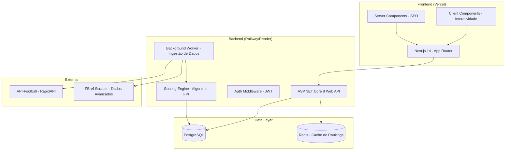
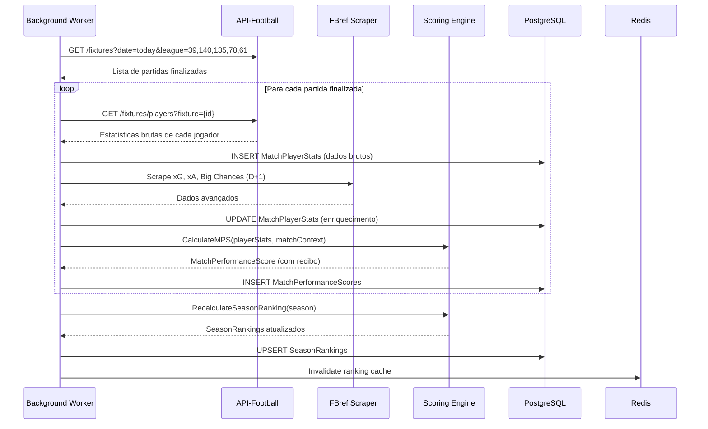
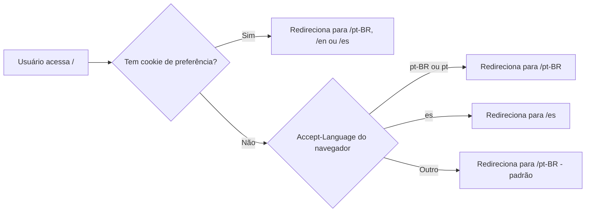

# The Real Best — Planejamento Completo de Arquitetura

> **Status:** Aguardando aprovação para iniciar implementação  
> **Stack:** ASP.NET Core 8 (C#) + Next.js 14 (React/TS) + PostgreSQL  
> **Deploy:** Vercel (Front) + Railway/Render (Back + DB)  
> **Idiomas:** Português (BR) · English · Español

---

## 1. Visão Geral da Arquitetura



---

## 2. Arquitetura do Backend (Clean Architecture)

Seguiremos **Clean Architecture** com separação rigorosa de responsabilidades:

```
TheRealBest.sln
│
├── src/
│   ├── TheRealBest.Domain/              # Camada de Domínio (Entidades, Value Objects, Interfaces)
│   │   ├── Entities/
│   │   │   ├── Player.cs
│   │   │   ├── Team.cs
│   │   │   ├── Competition.cs
│   │   │   ├── Match.cs
│   │   │   ├── MatchPlayerStats.cs       # Estatísticas brutas por jogador por partida
│   │   │   ├── MatchPerformanceScore.cs  # MPS calculado (o "recibo" auditável)
│   │   │   └── SeasonRanking.cs          # FSS acumulado do ranking
│   │   ├── Enums/
│   │   │   ├── PlayerPosition.cs         # GK, CB, FB, CDM, CM, CAM, W, ST
│   │   │   ├── CompetitionTier.cs        # WorldCup, UCLKnockout, TopLeague, etc.
│   │   │   └── ActionType.cs             # Goal, Assist, Tackle, Interception, etc.
│   │   ├── ValueObjects/
│   │   │   ├── ScoringWeight.cs          # Peso de uma ação para uma posição
│   │   │   ├── ContextMultiplier.cs      # Multiplicadores de torneio/adversário/clutch
│   │   │   └── MatchReceipt.cs           # Extrato itemizado de uma partida
│   │   ├── Interfaces/
│   │   │   ├── IPlayerRepository.cs
│   │   │   ├── IMatchRepository.cs
│   │   │   ├── IScoringEngine.cs
│   │   │   ├── IRankingRepository.cs
│   │   │   ├── ITranslationService.cs    # Serviço de tradução por locale
│   │   │   └── IFootballDataProvider.cs  # Abstração da fonte de dados externa
│   │   └── Specifications/
│   │       └── PlayerRankingSpec.cs       # Filtros posicionais, ligas, temporadas
│   │
│   ├── TheRealBest.Application/          # Camada de Aplicação (Use Cases, DTOs, Validações)
│   │   ├── DTOs/
│   │   │   ├── PlayerRankingDto.cs
│   │   │   ├── MatchReceiptDto.cs        # O "recibo" que o frontend exibe
│   │   │   ├── PlayerProfileDto.cs
│   │   │   ├── SeasonSummaryDto.cs
│   │   │   └── BallonComparison.cs       # DTO da aba "vs Ballon d'Or"
│   │   ├── UseCases/
│   │   │   ├── GetRankingUseCase.cs
│   │   │   ├── GetPlayerProfileUseCase.cs
│   │   │   ├── GetMatchReceiptUseCase.cs
│   │   │   ├── CalculateMatchScoreUseCase.cs
│   │   │   ├── RecalculateSeasonRankingUseCase.cs
│   │   │   └── IngestMatchDataUseCase.cs
│   │   ├── Localization/
│   │   │   ├── LocalizedReceiptBuilder.cs  # Monta o recibo auditável no idioma correto
│   │   │   └── ActionLabelResolver.cs     # Resolve labels de ações por locale
│   │   ├── Interfaces/
│   │   │   └── ICacheService.cs
│   │   ├── Mappings/
│   │   │   └── AutoMapperProfile.cs
│   │   └── Validators/
│   │       └── FluentValidation rules
│   │
│   ├── TheRealBest.Infrastructure/       # Camada de Infraestrutura (Implementações concretas)
│   │   ├── Data/
│   │   │   ├── AppDbContext.cs            # EF Core DbContext
│   │   │   ├── Configurations/            # Fluent API (mapeamento de entidades)
│   │   │   │   ├── PlayerConfiguration.cs
│   │   │   │   ├── MatchConfiguration.cs
│   │   │   │   ├── MatchPlayerStatsConfiguration.cs
│   │   │   │   └── MatchPerformanceScoreConfiguration.cs
│   │   │   ├── Repositories/
│   │   │   │   ├── PlayerRepository.cs
│   │   │   │   ├── MatchRepository.cs
│   │   │   │   └── RankingRepository.cs
│   │   │   └── Migrations/
│   │   ├── ExternalApis/
│   │   │   ├── ApiFootball/
│   │   │   │   ├── ApiFootballClient.cs   # HttpClient tipado para API-Football
│   │   │   │   ├── ApiFootballModels.cs   # Modelos de resposta da API externa
│   │   │   │   └── ApiFootballMapper.cs   # Mapeia API externa → Entidades de domínio
│   │   │   └── FBref/
│   │   │       └── FBrefScraper.cs        # Scraper para dados avançados (xG, xA)
│   │   ├── Caching/
│   │   │   └── RedisCacheService.cs
│   │   ├── Localization/
│   │   │   └── TranslationService.cs      # Implementação de ITranslationService (DB + cache)
│   │   └── DependencyInjection.cs         # Registro de serviços no container
│   │
│   ├── TheRealBest.Scoring/              # Módulo isolado do Motor de Pontuação
│   │   ├── ScoringEngine.cs               # Implementação do IScoringEngine
│   │   ├── WeightMatrices/
│   │   │   ├── GoalkeeperWeights.cs
│   │   │   ├── CenterBackWeights.cs
│   │   │   ├── FullBackWeights.cs
│   │   │   ├── DefensiveMidWeights.cs
│   │   │   ├── AttackingMidWeights.cs
│   │   │   ├── WingerWeights.cs
│   │   │   └── StrikerWeights.cs
│   │   ├── Multipliers/
│   │   │   ├── TournamentMultiplier.cs
│   │   │   ├── OpponentStrengthMultiplier.cs
│   │   │   └── ClutchFactorMultiplier.cs
│   │   ├── Calculators/
│   │   │   ├── MatchPerformanceCalculator.cs  # Calcula MPS por partida
│   │   │   ├── SeasonScoreCalculator.cs       # Calcula FSS da temporada
│   │   │   └── MinutesFactorCalculator.cs     # Normalização por minutos
│   │   └── Rules/
│   │       └── ScoringRulesProvider.cs        # Carrega regras do banco (configuráveis)
│   │
│   └── TheRealBest.API/                  # Camada de Apresentação (Controllers, Middleware)
│       ├── Controllers/
│       │   ├── RankingController.cs
│       │   ├── PlayersController.cs
│       │   ├── MatchesController.cs
│       │   └── AuditController.cs         # Endpoint do "recibo" de pontuação
│       ├── Middleware/
│       │   ├── ExceptionHandlingMiddleware.cs
│       │   ├── RateLimitingMiddleware.cs
│       │   ├── LocalizationMiddleware.cs     # Detecta Accept-Language → resolve locale
│       │   └── RequestLoggingMiddleware.cs
│       ├── Resources/                        # Arquivos .resx de localização
│       │   ├── Messages.pt-BR.resx
│       │   ├── Messages.en.resx
│       │   ├── Messages.es.resx
│       │   ├── ActionLabels.pt-BR.resx       # Labels de ações do recibo
│       │   ├── ActionLabels.en.resx
│       │   └── ActionLabels.es.resx
│       ├── Filters/
│       │   └── ApiKeyAuthFilter.cs        # Proteção dos endpoints admin
│       ├── BackgroundServices/
│       │   ├── MatchDataIngestionService.cs   # Worker que roda após rodadas
│       │   └── RankingRecalculationService.cs # Recalcula FSS periodicamente
│       ├── Program.cs
│       ├── appsettings.json
│       └── appsettings.Development.json
│
├── tests/
│   ├── TheRealBest.Domain.Tests/
│   ├── TheRealBest.Application.Tests/
│   ├── TheRealBest.Scoring.Tests/         # Testes unitários do motor de pontuação
│   │   ├── ScoringEngineTests.cs
│   │   ├── MatchPerformanceCalculatorTests.cs
│   │   └── WeightMatrixTests.cs
│   └── TheRealBest.API.IntegrationTests/
│
└── docs/
    ├── CONTEXT.md                         # Contexto completo do projeto para agentes
    ├── fair_ranking_formula_specification.md
    └── api-endpoints.md
```

---

## 3. Modelagem do Banco de Dados (PostgreSQL)

```mermaid
erDiagram
    PLAYERS {
        uuid id PK
        string external_api_id UK
        string name
        string nationality
        date date_of_birth
        string photo_url
        enum primary_position
        timestamp created_at
        timestamp updated_at
    }

    TEAMS {
        uuid id PK
        string external_api_id UK
        string name
        string short_name
        string logo_url
        string country
        int elo_ranking
    }

    COMPETITIONS {
        uuid id PK
        string external_api_id UK
        string name
        string country
        enum tier
        decimal tournament_multiplier
        int season_year
    }

    MATCHES {
        uuid id PK
        string external_api_id UK
        uuid competition_id FK
        uuid home_team_id FK
        uuid away_team_id FK
        int home_score
        int away_score
        string round_phase
        date match_date
        boolean is_knockout
        timestamp created_at
    }

    MATCH_PLAYER_STATS {
        uuid id PK
        uuid match_id FK
        uuid player_id FK
        uuid team_id FK
        enum position_played
        int minutes_played
        int goals
        int assists
        int shots_total
        int shots_on_target
        int passes_total
        int passes_accurate
        decimal pass_accuracy
        int key_passes
        int tackles_total
        int interceptions
        int blocks
        int duels_total
        int duels_won
        int aerial_duels_won
        int aerial_duels_total
        int dribbles_attempted
        int dribbles_success
        int dribbled_past
        int fouls_committed
        int fouls_drawn
        int yellow_cards
        int red_cards
        int offsides
        int saves
        int goals_conceded
        int penalties_won
        int penalties_committed
        int penalties_saved
        int penalties_missed
        boolean clean_sheet
        decimal xg
        decimal xa
        int big_chances_missed
        int big_chances_created
        int errors_leading_to_goal
        int shot_creating_actions
        int progressive_passes
        int progressive_carries
        int ball_recoveries
        int turnovers
        int touches
        timestamp created_at
    }

    MATCH_PERFORMANCE_SCORES {
        uuid id PK
        uuid match_id FK
        uuid player_id FK
        enum position_evaluated
        decimal base_score
        jsonb action_breakdown
        jsonb penalty_breakdown
        decimal subtotal_raw
        decimal tournament_multiplier
        decimal opponent_multiplier
        decimal clutch_multiplier
        decimal context_multiplier_combined
        decimal minutes_factor
        decimal final_mps
        timestamp calculated_at
        int algorithm_version
    }

    SEASON_RANKINGS {
        uuid id PK
        uuid player_id FK
        int season_year
        int total_matches
        int total_minutes
        decimal mps_average
        decimal mps_sum_weighted
        decimal presence_factor
        decimal fss_score
        int overall_rank
        int position_rank
        decimal clutch_index
        jsonb top_5_matches
        timestamp recalculated_at
    }

    SCORING_WEIGHTS {
        uuid id PK
        enum position
        string action_type
        decimal weight_value
        string description
        boolean is_penalty
        int version
    }

    PLAYERS ||--o{ MATCH_PLAYER_STATS : "has stats in"
    MATCHES ||--o{ MATCH_PLAYER_STATS : "contains"
    TEAMS ||--o{ MATCHES : "plays in"
    COMPETITIONS ||--o{ MATCHES : "hosts"
    MATCH_PLAYER_STATS ||--|| MATCH_PERFORMANCE_SCORES : "generates"
    PLAYERS ||--o{ SEASON_RANKINGS : "ranked in"
    PLAYERS ||--o{ MATCH_PERFORMANCE_SCORES : "scored in"
    MATCHES ||--o{ MATCH_PERFORMANCE_SCORES : "produces"
```



> [!IMPORTANT]
> A tabela `MATCH_PERFORMANCE_SCORES` armazena o **extrato completo** de cada partida (os campos `action_breakdown` e `penalty_breakdown` são JSONB contendo cada linha do "recibo"). Isso garante **auditabilidade total**: o frontend renderiza exatamente o que está salvo, sem recalcular nada no cliente.

---

## 4. Arquitetura do Frontend (Next.js 14 + TypeScript)

```
frontend/
├── src/
│   ├── app/                              # App Router (Next.js 14)
│   │   ├── globals.css                   # Design tokens + reset
│   │   ├── [locale]/                     # Roteamento por idioma (pt-BR, en, es)
│   │   │   ├── layout.tsx                # Layout com NextIntlClientProvider
│   │   │   ├── page.tsx                  # Home: Hero + Leaderboard resumido
│   │   │   ├── ranking/
│   │   │   │   └── page.tsx              # Ranking completo com filtros
│   │   │   ├── player/
│   │   │   │   └── [slug]/
│   │   │   │       └── page.tsx          # Perfil do jogador + extrato
│   │   │   ├── match/
│   │   │   │   └── [id]/
│   │   │   │       └── page.tsx          # Detalhamento de partida
│   │   │   ├── vs-ballon/
│   │   │   │   └── page.tsx              # Comparativo vs Ballon d'Or
│   │   │   └── formula/
│   │   │       └── page.tsx              # Livro de Regras
│   │   └── api/                          # Route Handlers (BFF)
│   │       └── revalidate/
│   │           └── route.ts
│   │
│   ├── i18n/                             # Internacionalização (next-intl)
│   │   ├── routing.ts                    # Config de locales e defaultLocale
│   │   ├── request.ts                    # getRequestConfig (server-side)
│   │   └── navigation.ts                # Link, redirect, usePathname localizados
│   │
│   ├── messages/                         # Arquivos de tradução por idioma
│   │   ├── pt-BR/
│   │   │   ├── common.json               # Navegação, footer, labels gerais
│   │   │   ├── ranking.json              # Tabela, filtros, cabeçalhos
│   │   │   ├── player.json               # Perfil, resumo sazonal
│   │   │   ├── receipt.json              # Cada label do extrato auditável
│   │   │   ├── formula.json              # Livro de regras
│   │   │   └── positions.json            # Nomes de posições e ações
│   │   ├── en/
│   │   │   ├── common.json
│   │   │   ├── ranking.json
│   │   │   ├── player.json
│   │   │   ├── receipt.json
│   │   │   ├── formula.json
│   │   │   └── positions.json
│   │   └── es/
│   │       ├── common.json
│   │       ├── ranking.json
│   │       ├── player.json
│   │       ├── receipt.json
│   │       ├── formula.json
│   │       └── positions.json
│   │
│   ├── components/
│   │   ├── ui/                           # Componentes genéricos reutilizáveis
│   │   │   ├── Button.tsx
│   │   │   ├── Card.tsx
│   │   │   ├── Badge.tsx
│   │   │   ├── Table.tsx
│   │   │   ├── Modal.tsx
│   │   │   ├── Drawer.tsx
│   │   │   ├── Tooltip.tsx
│   │   │   ├── Skeleton.tsx
│   │   │   └── FilterChip.tsx
│   │   ├── layout/
│   │   │   ├── Header.tsx
│   │   │   ├── Footer.tsx
│   │   │   ├── MobileNav.tsx
│   │   │   └── LocaleSwitcher.tsx         # Seletor de idioma (PT-BR / EN / ES)
│   │   ├── ranking/
│   │   │   ├── LeaderboardTable.tsx
│   │   │   ├── PlayerRow.tsx
│   │   │   ├── PositionFilter.tsx
│   │   │   └── SearchBar.tsx
│   │   ├── player/
│   │   │   ├── PlayerHero.tsx
│   │   │   ├── SeasonSummaryCards.tsx
│   │   │   ├── RadarChart.tsx            # Gráfico de teia de habilidades
│   │   │   ├── MatchTimeline.tsx
│   │   │   └── MatchReceipt.tsx          # O "recibo" auditável (componente central)
│   │   └── comparison/
│   │       ├── VsCard.tsx
│   │       └── DiscrepancyBadge.tsx
│   │
│   ├── lib/
│   │   ├── api.ts                        # Client HTTP (envia Accept-Language ao backend)
│   │   ├── types.ts                      # Tipagens TypeScript (espelham os DTOs)
│   │   └── utils.ts                      # Formatadores, helpers
│   │
│   ├── hooks/
│   │   ├── useRanking.ts
│   │   ├── usePlayerProfile.ts
│   │   └── useMatchReceipt.ts
│   │
│   └── styles/
│       └── design-tokens.css             # Variáveis CSS do design system
│
├── middleware.ts                          # next-intl middleware (detecção de locale)
├── public/
│   ├── fonts/
│   └── images/
├── next.config.ts                        # Plugin next-intl
├── tailwind.config.ts
├── tsconfig.json
└── package.json
```

---

## 5. Endpoints da API REST

| Método | Rota | Descrição |
| :---: | :--- | :--- |
| `GET` | `/api/v1/ranking` | Ranking geral com paginação, filtros por posição, liga e temporada |
| `GET` | `/api/v1/ranking/positions/{position}` | Ranking filtrado por posição (ex: `CB`, `ST`, `CDM`) |
| `GET` | `/api/v1/players/{slug}` | Perfil completo do jogador (summary, radar, stats sazonais) |
| `GET` | `/api/v1/players/{slug}/matches` | Lista de partidas do jogador com MPS de cada uma |
| `GET` | `/api/v1/players/{slug}/matches/{matchId}/receipt` | **O recibo auditável** — extrato completo da pontuação |
| `GET` | `/api/v1/players/{slug}/season-summary` | FSS, média, clutch index, fator de presença |
| `GET` | `/api/v1/matches/{id}` | Detalhes de uma partida (times, placar, competição) |
| `GET` | `/api/v1/matches/{id}/scores` | Todas as pontuações de todos os jogadores daquela partida |
| `GET` | `/api/v1/comparisons/vs-ballon` | Dados do comparativo The Real Best vs. Ballon d'Or |
| `GET` | `/api/v1/formula/weights` | Pesos configurados do algoritmo por posição (transparência) |
| `POST` | `/api/v1/admin/ingest/{matchExternalId}` | [Admin] Força ingestão de dados de uma partida |
| `POST` | `/api/v1/admin/recalculate/{season}` | [Admin] Recalcula o ranking de uma temporada inteira |

---

## 6. Pipeline de Ingestão de Dados (Background Workers)



---

## 7. Fases de Implementação

### Fase 1 — Fundação (Semanas 1-2)
- [ ] Estrutura da Solution .NET (Clean Architecture)
- [ ] Modelagem do banco PostgreSQL + Migrations (EF Core)
- [ ] Entidades de domínio (Player, Match, MatchPlayerStats)
- [ ] Tabelas de tradução (competition_translations, action_type_translations)
- [ ] Setup do projeto Next.js 14 com design system e next-intl
- [ ] Estrutura de arquivos de tradução (messages/pt-BR, en, es)
- [ ] Middleware de detecção de locale + LocaleSwitcher
- [ ] CONTEXT.md e Rules no repositório
- [ ] CI/CD básico (GitHub Actions)

### Fase 2 — Motor de Pontuação (Semanas 3-4)
- [ ] Implementação do `ScoringEngine` com todas as matrizes de peso
- [ ] `MatchPerformanceCalculator` (cálculo do MPS)
- [ ] `SeasonScoreCalculator` (cálculo do FSS)
- [ ] Multiplicadores de contexto (Torneio, Adversário, Clutch)
- [ ] Testes unitários exaustivos do motor (cenários reais)

### Fase 3 — Ingestão de Dados (Semanas 5-6)
- [ ] Client HTTP tipado para API-Football
- [ ] Background Worker de ingestão pós-rodada
- [ ] Scraper básico para FBref (xG, xA)
- [ ] Pipeline completo: API → Stats → Scoring → Ranking
- [ ] Seeds com dados reais da temporada 2023/24

### Fase 4 — API REST + Frontend (Semanas 7-9)
- [ ] Controllers REST com paginação e filtros
- [ ] LocalizationMiddleware no backend (.resx + IStringLocalizer)
- [ ] Cache Redis para rankings (chave por locale)
- [ ] Página de Ranking (Leaderboard com filtros posicionais) — 3 idiomas
- [ ] Página de Perfil do Jogador (radar + timeline) — 3 idiomas
- [ ] Componente `MatchReceipt` (recibo auditável com labels traduzidos)
- [ ] Página comparativa vs. Ballon d'Or — 3 idiomas
- [ ] Página do Livro de Regras (transparência) — 3 idiomas
- [ ] SEO multilíngue (hreflang, Open Graph localizado, sitemap)

### Fase 5 — Deploy e Polish (Semana 10)
- [ ] Deploy do backend em Railway/Render
- [ ] Deploy do frontend em Vercel
- [ ] Configuração de domínio personalizado
- [ ] SEO multilíngue, Open Graph por locale, performance (Lighthouse 90+)
- [ ] Testes de integração e E2E
- [ ] Validação de todas as traduções (revisão de pt-BR, en, es)

---

## 8. Estratégia de Internacionalização (i18n)

### Idiomas Suportados
| Código | Idioma | URL Base | Status |
| :---: | :--- | :--- | :---: |
| `pt-BR` | Português (Brasil) | `/pt-BR/ranking` | **Padrão** |
| `en` | English | `/en/ranking` | Suportado |
| `es` | Español | `/es/ranking` | Suportado |

### Frontend (next-intl)

**Biblioteca:** [`next-intl`](https://next-intl.dev/) — integração nativa com App Router do Next.js 14, suporte a Server Components e SSR.

**Fluxo de Detecção de Idioma:**


**Organização dos Arquivos de Tradução:**
Cada namespace (`common`, `ranking`, `player`, `receipt`, `formula`, `positions`) é um JSON separado por idioma. Exemplo de `messages/pt-BR/receipt.json`:
```json
{
  "baseScore": "Nota Base ao Entrar em Campo",
  "actionsTitle": "Ações Específicas da Função",
  "penaltiesTitle": "Deduções & Falhas",
  "contextTitle": "Multiplicadores de Contexto",
  "finalScore": "Pontuação Final Auditada",
  "actions": {
    "goal_open_play": "{count, plural, one {# Gol de bola rolando} other {# Gols de bola rolando}}",
    "goal_penalty": "{count, plural, one {# Gol de pênalti} other {# Gols de pênalti}}",
    "assist": "{count, plural, one {# Assistência direta} other {# Assistências diretas}}",
    "tackle_won": "{count, plural, one {# Desarme ganho} other {# Desarmes ganhos}}",
    "clean_sheet": "Clean Sheet mantido",
    "big_chance_missed": "{count, plural, one {# Grande chance perdida} other {# Grandes chances perdidas}}"
  },
  "multipliers": {
    "tournament": "Torneio: {name}",
    "opponent": "Força do Adversário: {level}",
    "clutch": "Fator Decisivo"
  }
}
```

**Uso nos Componentes (Server Components):**
```tsx
import { useTranslations } from 'next-intl';

export function MatchReceipt({ data }) {
  const t = useTranslations('receipt');
  return (
    <div>
      <h3>{t('actionsTitle')}</h3>
      <span>{t('actions.goal_open_play', { count: data.goals })}</span>
    </div>
  );
}
```

**Componente `LocaleSwitcher`:**
Um seletor de idioma no header que troca o locale mantendo a mesma página:
- 🇧🇷 PT-BR | 🇺🇸 EN | 🇪🇸 ES
- Salva preferência em cookie `NEXT_LOCALE` para visitas futuras
- Alterna a URL sem recarregar a página completa

### Backend (.NET — Localização de Conteúdo Dinâmico)

**Middleware de Localização:**
```csharp
// LocalizationMiddleware.cs
// 1. Lê o header Accept-Language da request
// 2. Resolve para pt-BR, en ou es
// 3. Seta CultureInfo.CurrentCulture e CurrentUICulture
// 4. Disponibiliza o locale para os Use Cases via IStringLocalizer
```

**O que é traduzido no backend:**
| Conteúdo | Estratégia |
| :--- | :--- |
| Labels de ações do recibo ("Gol de bola rolando", "Desarme ganho") | Arquivos `.resx` por locale (`ActionLabels.pt-BR.resx`) |
| Nomes de competições ("Champions League" / "Liga dos Campeões") | Tabela `COMPETITION_TRANSLATIONS` no banco |
| Nomes de posições ("Volante Central" / "Defensive Midfielder") | Arquivos `.resx` por locale (`Positions.pt-BR.resx`) |
| Mensagens de erro e validação | Arquivos `.resx` por locale (`Messages.pt-BR.resx`) |
| Nomes de jogadores e times | **Não traduzidos** — mantidos no idioma original |

### Banco de Dados — Tabela de Traduções

Para conteúdo dinâmico que vem do banco (nomes de competições, fases de torneio):

```sql
CREATE TABLE competition_translations (
    id UUID PRIMARY KEY DEFAULT gen_random_uuid(),
    competition_id UUID NOT NULL REFERENCES competitions(id),
    locale VARCHAR(5) NOT NULL,              -- 'pt-BR', 'en', 'es'
    name VARCHAR(255) NOT NULL,
    country_name VARCHAR(100),
    UNIQUE(competition_id, locale)
);

-- Exemplo:
-- competition_id | locale | name                       | country_name
-- uuid-ucl       | pt-BR  | Liga dos Campeões da UEFA  | Europa
-- uuid-ucl       | en     | UEFA Champions League      | Europe
-- uuid-ucl       | es     | Liga de Campeones de la UEFA| Europa

CREATE TABLE action_type_translations (
    id UUID PRIMARY KEY DEFAULT gen_random_uuid(),
    action_key VARCHAR(50) NOT NULL,          -- 'goal_open_play', 'tackle_won', etc.
    locale VARCHAR(5) NOT NULL,
    label VARCHAR(255) NOT NULL,
    label_plural VARCHAR(255),
    UNIQUE(action_key, locale)
);
```

### SEO Multilíngue

Cada página gera automaticamente:
- Tags `<html lang="pt-BR">` / `<html lang="en">` / `<html lang="es">`
- Meta tags `hreflang` para Google indexar todas as versões:
```html
<link rel="alternate" hreflang="pt-BR" href="https://therealbest.com/pt-BR/ranking" />
<link rel="alternate" hreflang="en" href="https://therealbest.com/en/ranking" />
<link rel="alternate" hreflang="es" href="https://therealbest.com/es/ranking" />
<link rel="alternate" hreflang="x-default" href="https://therealbest.com/en/ranking" />
```
- Open Graph com título e descrição localizados para compartilhamento em redes sociais

---

## 9. Decisões Arquiteturais Importantes

| Decisão | Escolha | Justificativa |
| :--- | :--- | :--- |
| **ORM** | Entity Framework Core 8 | Migrations automáticas, LINQ poderoso para queries analíticas, Code First |
| **Validação** | FluentValidation | Validações expressivas e testáveis, separadas dos controllers |
| **Mapping** | AutoMapper (ou Mapster) | Conversão limpa entre entidades e DTOs |
| **Logging** | Serilog | Structured logging, sinks flexíveis (Console, Seq, File) |
| **Cache** | Redis via StackExchange.Redis | Ranking muda só após rodadas; cache de 1-6h reduz carga no DB |
| **HTTP Client** | Refit ou HttpClientFactory | Clients tipados para APIs externas, retry policies com Polly |
| **Testes** | xUnit + FluentAssertions + Moq | Stack de testes padrão .NET, assertions legíveis |
| **Frontend Charts** | Recharts ou Nivo | Radar charts, line charts de evolução, bar charts comparativos |
| **CSS** | Tailwind CSS 4 | Produtividade no frontend, design system via tokens |
| **i18n Frontend** | next-intl | Integração nativa com App Router, Server Components, type-safe |
| **i18n Backend** | IStringLocalizer (.resx) + DB | Labels estáticos em .resx, conteúdo dinâmico em tabela de traduções |
| **Detecção de Locale** | Accept-Language + Cookie | Detecta idioma do navegador, permite override manual via LocaleSwitcher |
